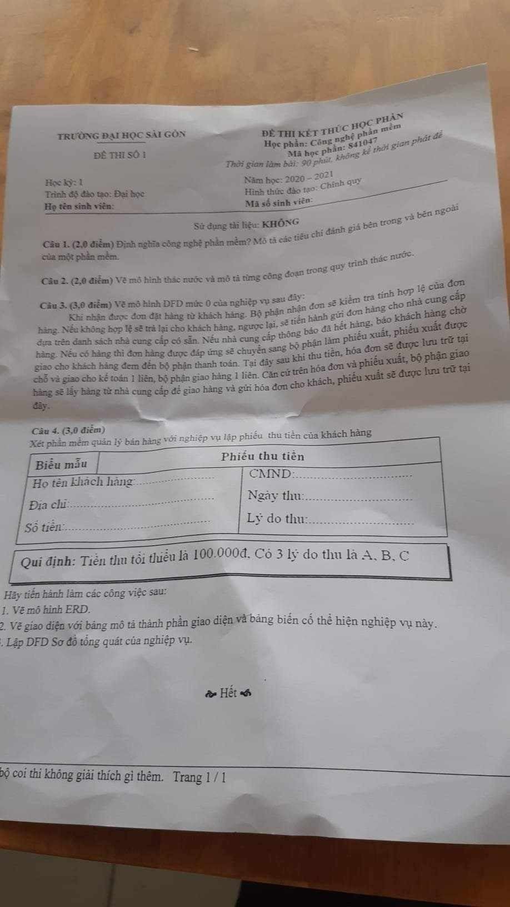
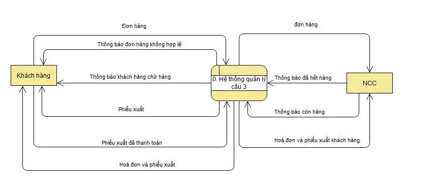
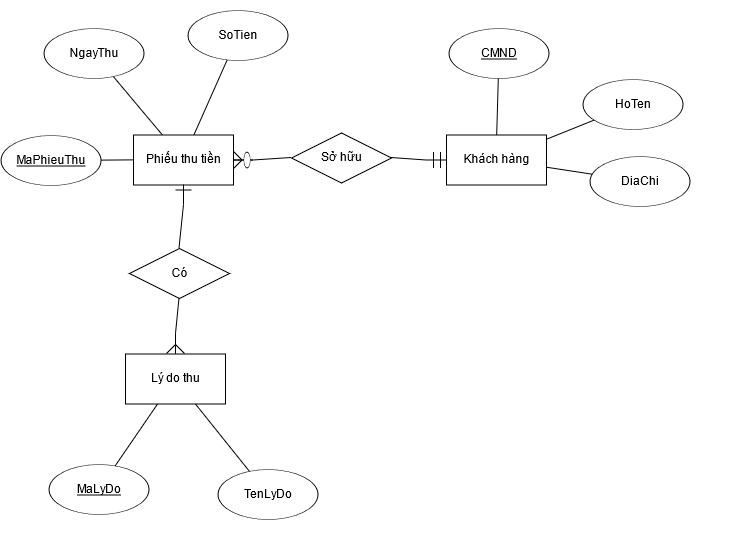
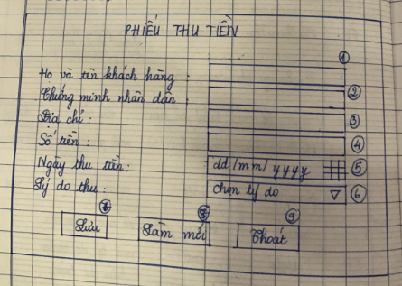
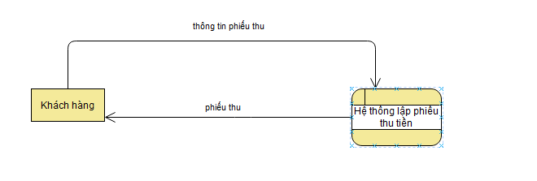
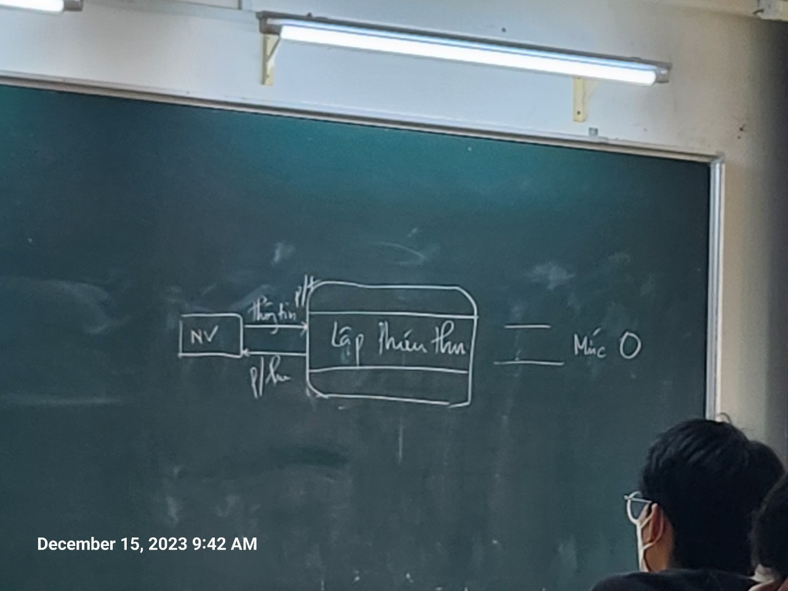

---
authors:
  - duy
tags:
  - school
  - CNPM
share: true
date: 2023-12-31
modified_at: 2023-12-31
---

# C3

# C4
## ERD

## Thiết kế giao diện

// *Nếu không kịp thời gian có thể bỏ nút 8,9*
### Bảng mô tả thành phần

| ID | Tên | Kiểu | Quy định | Mô tả |
| ---- | ---- | ---- | ---- | ---- |
| 1 | HoTen | text | Bắt buộc, chỉ chứa ký tự chữ |  |
| 2 | CMND | text | Bắt buộc, theo định dạng CMND của nhà nước |  |
| 3 | DiaChi | text | Bắt buộc, |  |
| 4 | SoTien | text | Bắt buộc, chỉ chứa ký tự số, số tiền tối thiểu là 100.000đ |  |
| 5 | NgayThuTien | date | Bắt buộc |  |
| 6 | LyDoThu | select | Bắt buộc, trong 3 lý do thu A,B,C |  |
| 7 | Luu | Button | Bắt buộc nhập hết dữ liệu |  |
| 8 | LamMoi | Button |  |  |
| 9 | Thoat | Button |  |  |

### Bảng mô tả biến cố

| ID | Thành phần | Tên | Mô tả |
| ---- | ---- | ---- | ---- |
| 1 | 5 | Click vào date ngày thu tiền | Hiển thị ngày tháng trong năm để chọn, mặc định là ngày tháng hiện tại |
| 2 | 6 | Click vào select lý do | Hiển thị ds lý do để lựa chọn |
| 3 | 7 | click vào nút lưu | TH1: Nếu tất cả dữ liệu nhập là hợp lệ thì lưu vào CSDL TH2: Nếu dữ liệu nhập không hợp lệ thì báo lỗi |
| 4 | 8 | Click vào button reset | Làm mới tất cả dữ liệu trong các ô |
| 5 | 9 | click vào button Thoát | Khi người dùng ấn vào sẽ thoát khỏi màn hình hiện tại |

## DFD tổng quan

### C1 : dưới góc nhìn là website

### C2 : dưới góc nhìn bán trực tiếp

