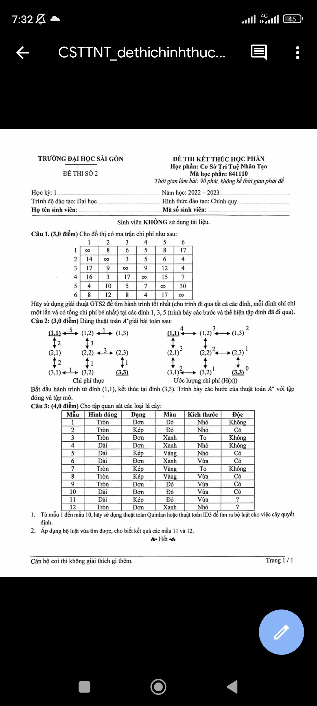
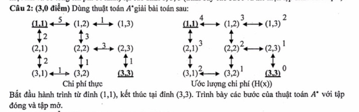

---
authors:
  - duy
tags: 
share: true
date: 2023-12-16
modified_at: 2023-12-27
dg-publish: false
---

Tags:
fd

---
# C1:
GTS(1)=
GTS(3)
C2:
ádfdsfafdsfasf
# C2:

| Bước | Đỉnh N | Đỉnh kề với N | Tinh giá trị f(N) | OPEN | CLOSED |
| ---- | ---- | ---- | ---- | ---- | ---- |
| 0 |  |  | f(1,1) = 4 | [(1,1)] | [] |
| 1 | (1,1) | (1,2), (2,1) | f(1,2) = 5 + 3 = 8 f(2,1) = 2 + 3 = 5 | [(1,2),(2,1)] | [(1,1)] |
| 2 | (2,1) | (3,1) | f(1,2)= 8 f(3,1)= 2+2+2= 6 | [ (3,1), (1,2)] | [(1,1), (2,1)] |
| 3 | (3,1) | (3,2) | f(1,2)= 8 f(3,2)=2+2+1+2=7 | [ (3,2), (1,2)] | [(1,1),(2,1), (3,1)] |
| 4 | (3,2) | (2,2) | f(1,2)=8 f(2,2)=2+2+1+1+2=8 | [(2,2) (1,2)] | [(1,1),(2,1), (3,1),(3,2)] |
| 5 | (1,2) | (1,3), (2,2), | f(2,2)=8 f(1,3)=5+1+2=8  | (1,3), (2,2) | [(1,1),(2,1), (3,1),(3,2),(1,2)] |
| 6 | (1,3) |  | f(2,2)=8 | (2,2) | [(1,1),(2,1), (3,1),(3,2),(1,2)] |
| 7 | (2,2) | (2,3) | f(2,3)=2+2+1+1+3+1=10 | (2,3) | [(1,1),(2,1), (3,1),(3,2),(1,2), (2,2)] |
| 8 | (2,3) | (3,3) | f(3,3)=2+2+1+1+3+1+1+0=11 | (3,3) | [(1,1),(2,1), (3,1),(3,2),(1,2), (2,3)] |
| 9 | (3,3) dừng vì là trạng thái đích |  |  |  |  |
Vậy hành trình tốt nhất từ (1,1) tới (3,3) là :
 (1,1)-> (2,1)-> (3,1)-> (3,2)-> (1,2)-> (1,3)-> (2,2)-> (2,3)->(3,3) có độ dài là 22
sd

---
# References

