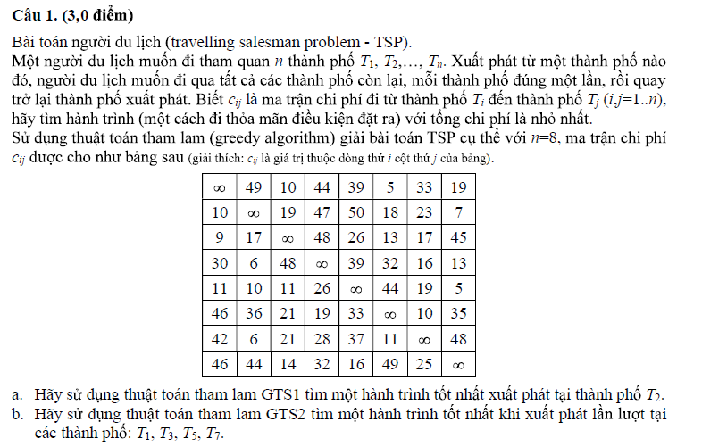
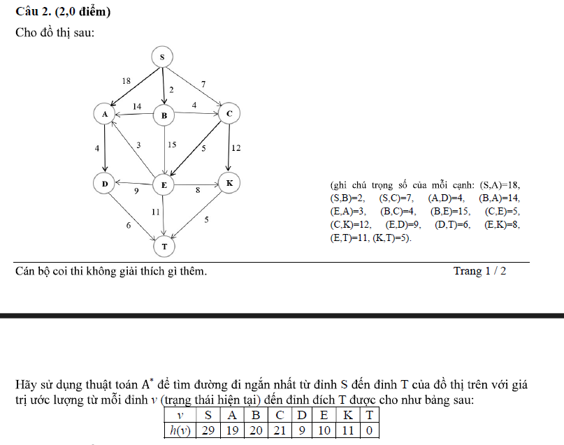
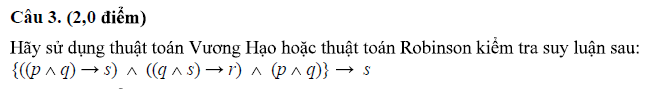
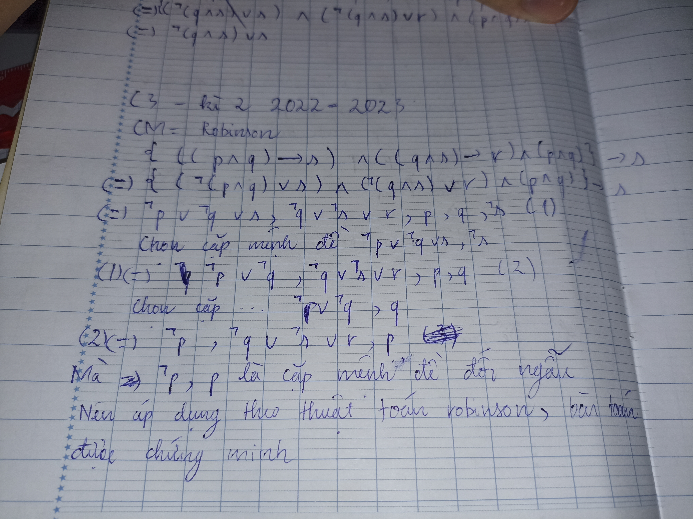
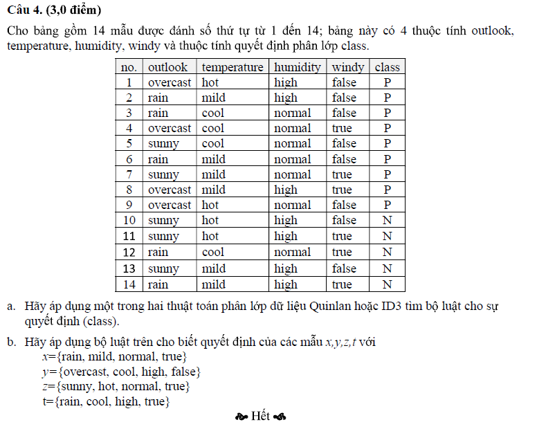
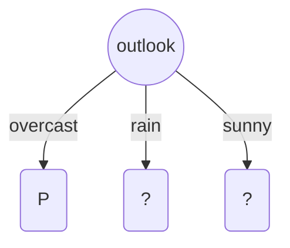
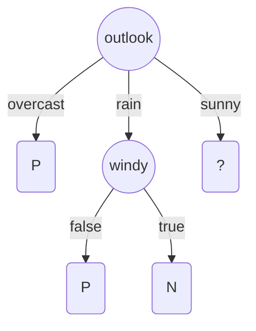
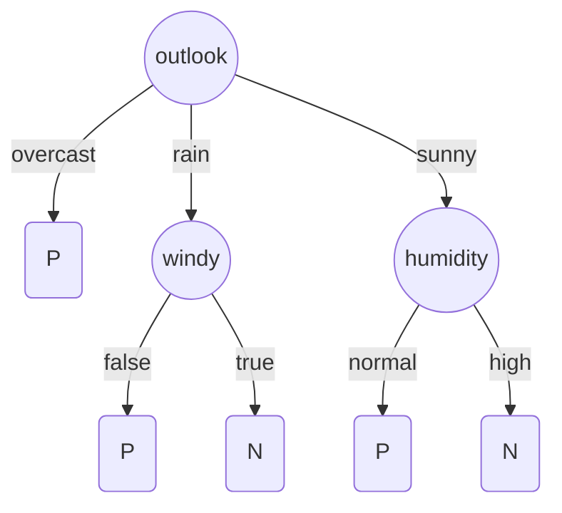

---
authors:
  - duy
tags:
  - school
  - CSTTNT
share: true
date: 2023-12-16
modified_at: 2023-12-30
---

Tags:

---
# Kì 2 đề 1 2022-2023

# Câu 1 :

a)

GTS1(T2)= 2->8->3->1->6->7->4->5->2
COST(T2)=7+14+9+5+10+28+39+10=122
b)
GTS1(T1)= 1->6->7->2->8->3->5->4->1
COST(T1)= 5+10+6+7+14+26+26+30=124

GTS1(T3)= 3->1->6->7->2->8->5->4->3
COST(T3)=9+5+10+6+7+16+26+48= 127

GTS1(T5)= 5->8->3->1 ->6->7->2->4->5
COST(T5)= 5 +14 + 9 + 5 + 10 + 6+47+39 = 135

GTS1(T7)= 7->2->8->3->1->6->4->5->7
COST(T7)= 6 + 7 + 14 + 9 + 5 + 19+39+19 = 118

Áp dụng giải thuạt tham lam GTS2 ta chọn hành trình chi phí tối ưu nhất là 118 với chi tiết hành trình:
7->2->8->3->1->6->4->5->7
# Câu 2 :

| Bước | Đỉnh N | Đỉnh kề với N | Tính giá trị f(N) | OPEN | CLOSED |
| ---- | ---- | ---- | ---- | ---- | ---- |
| 0 |  |  | f(S)=29 | [S] | [] |
| 1 | S | A,B,C | f(A)=18+19=37 f(B)= 2+20=22 f(C)= 7+21=28 | [A,B,C] | [S] |
| 2 | B | A,C,E | f(A)=2+14+19=35 f(C)=2+4+21=27 f(E)=2+15+10=27 | [A,C,E] | [S,B] |
| 3 | C | E,K | f(A)=35 f(E)=2+4+5+10=21 f(K)=2+4+12+11=29 | [A,E,K] | [S,B,C] |
| 4 | E | K,T | f(A)=35 f(K)=29 f(T)=2+4+5+11+0=22 | [A,K,T] | [S,B,C,E] |
| 5 | T, vì là mục tiêu nên dừng |  |  |  |  |

Vậy đường đi ngắn nhất từ đỉnh S đến T có chi phí là 22 với chi tiết hành trình là :
S->B->C->E->T
# Câu 3 :

cm= robinson:
{( (p^q) ->s ) ^ ( (q^s) ->r ) ^ (p ^ q) } -> s (1)

# Câu 4 :

a)

| no. | outlook  | tempenture | humidity | windy | class |
| --- | -------- | ---------- | -------- | ----- | ----- |
| 1   | overcast | hot        | high     | false | P     |
| 2   | rain     | mild       | high     | false | P     |
| 3   | rain     | cool       | normal   | false | P     |
| 4   | overcast | cool       | normal   | true  | P     |
| 5   | sunny    | cool       | normal   | false | P     |
| 6   | rain     | mild       | normal   | false | P     |
| 7   | sunny    | mild       | normal   | true  | P     |
| 8   | overcast | mild       | high     | true  | P     |
| 9   | overcast | hot        | normal   | false | P     |
| 10  | sunny    | hot        | high     | false | N     |
| 11  | sunny    | hot        | high     | true  | N     |
| 12  | rain     | cool       | normal   | true  | N     |
| 13  | sunny    | mild       | high     | false | N     |
| 14  | rain     | mild       | high     | true  | N     |

Gọi vector độ đo là V= (P, N)

- Thuộc tính outlook
V(outlook=overcast) = (4/4,0/4)=(1,0)
V(outlook= rain)= (3/5, 2/5)
V(outlook=sunny) = (2/5,3/5)
- Thuộc tính tempenture
V(tempenture= hot ) = (2/4, 2/4) = (1/2,1/2)
V(tempenture= mild ) = (4/6, 2/4) = (2/3,1/2)
V(tempenture= cool ) = (3/4, 1/4)
- Thuộc tính humidity
V(humidity=normal)=(6/7,1/7)
V(humidity=high)=(3/7,4/7)
- Thuộc tính windy
V( windy=false ) =(6/8, 2/8)= (3/4,1/4)
V( windy=true ) = (3/6, 3/6)= (1/2,1/2)

Chọn thuộc tính outlook làm thuộc tính phân loại ta có được cây quyết định

Bước 2 :
**CSDL ứng với outlook là rain**

| no. | outlook | tempenture | humidity | windy | class |
| ---- | ---- | ---- | ---- | ---- | ---- |
| 2 | rain | mild | high | false | P |
| 3 | rain | cool | normal | false | P |
| 6 | rain | mild | normal | false | P |
| 12 | rain | cool | normal | true | N |
| 14 | rain | mild | high | true | N |
Tính vector độ đo của các thuộc tính CSDL trên
- Thuộc tính tempenture
V(tempenture= mild ) = (2/3, 1/3)
V(tempenture= cool ) = (1/2, 1/2)
- Thuộc tính humidity
V(humidity=normal)=(2/3,2/3)
V(humidity=high)=(1/2,1/2)
- Thuộc tính windy
V( windy=false ) = (1, 0)
V( windy=true ) = (0, 1)
Chọn thuộc tính windy làm thuộc tính phân loại ta có được cây quyết định

**CSDL ứng với sunny**

| no. | outlook | tempenture | humidity | windy | class |
| ---- | ---- | ---- | ---- | ---- | ---- |
| 5 | sunny | cool | normal | false | P |
| 7 | sunny | mild | normal | true | P |
| 10 | sunny | hot | high | false | N |
| 11 | sunny | hot | high | true | N |
| 13 | sunny | mild | high | false | N |
Tính vector độ đo của các thuộc tính CSDL trên
- Thuộc tính tempenture
V(tempenture= mild ) = (1/2,1/2)
V(tempenture= hot ) = (0, 1)
V(tempenture= cool ) = (1, 0)
- Thuộc tính humidity
V(humidity=normal)=(1,0)
V(humidity=high)=(0,1)
- Thuộc tính windy
V( windy=false ) = (1/3, 2/3)
V( windy=true ) = (1/2, 1/2)
Chọn thuộc tính humidity làm thuộc tính phân loại ta có được cây quyết định
	

Từ cây quyết định ta có bộ luật sau :
Luật 1 nếu outlook = overcast thì P
Luật 2 nếu outlook= rain và windy là false thì là P
Luật 3 nếu outlook= rain và windy là true thì là N
Luật 4 nếu outlook= sunny và humidity = normal thì là P
Luật 5 nếu outlook= sunny và humidity = high thì là P
b) Hãy áp dụng bộ luật trên cho biết quyết định của các mẫu x,y,z, với
x={rain, mild, normal, true}
y={overcast, cool, high, false} z={sunny, hot, normal, true}
t={rain, cool, high, true}

| no. | outlook | tempenture | humidity | windy | class | Luật |
| ---- | ---- | ---- | ---- | ---- | ---- | ---- |
| x | rain | mild | normal | true | N | 3 |
| y | overcast | cool | high | false | P | 1 |
| z | sunny | hot | normal | true | P | 4 |
| t | rain | cool | high | true | N | 3 |

---
# References

Trang chủ
https://sites.google.com/view/dangnt-courses/%C4%91%E1%BA%A1i-h%E1%BB%8Dc/sgu/tr%C3%AD-tu%E1%BB%87-nh%C3%A2n-t%E1%BA%A1o/ai-2023-2024-hk1

Đề thi
https://drive.google.com/file/d/12ihXubS-oQxOYLtCEWndsMNtGeopAMV7/view
