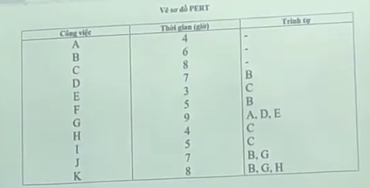
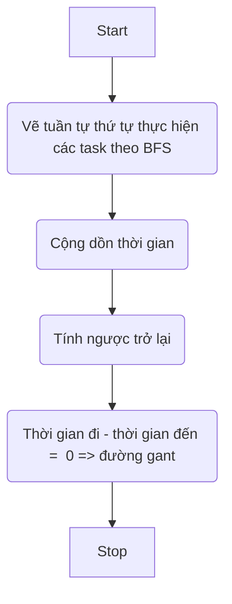

---
# PERT

> Tóm lược các bước thực hiện

```mermaid
flowchart TB
id1("Vẽ tuần tự thứ tự thực hiện các task theo BFS")
id2("Cộng dồn thời gian")
id3("Tính ngược trở lại")
id4("Thời gian đi - thời gian đến =  0 => đường gant")
Start -->id1-->id2-->id3-->id4--> Stop


```

---
# References (lý thuyết + thực hành)

https://www.youtube.com/watch?v=9ROCH2h-Tgo